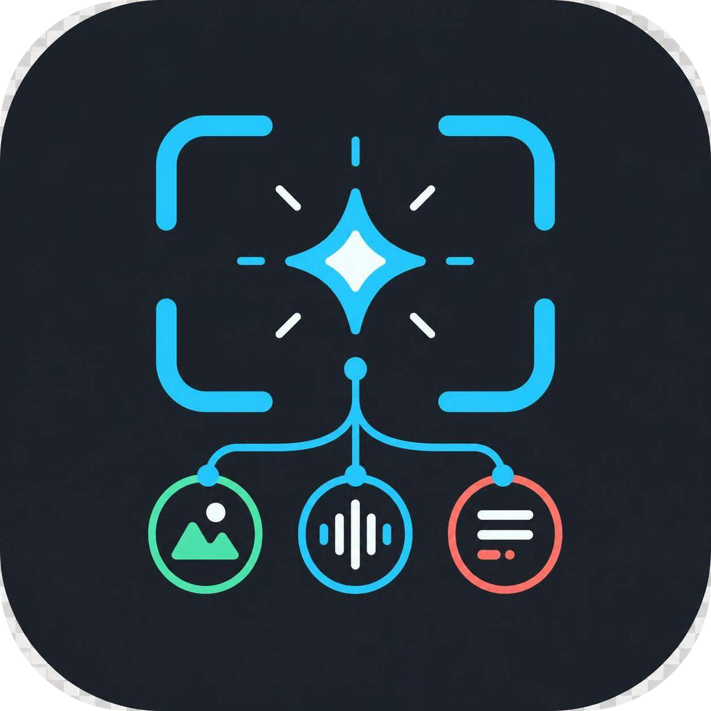

# 桌面多模态 AI 助手

<p align="center">
  
</p>

<p align="center">
  面向中文用户的 Electron AI 桌面助手，提供截屏分析、文字对话和实时语音转录。
</p>

## 功能概览

### 截图解题

- 使用全局快捷键截取屏幕，调用视觉模型并流式展示解答
- 支持追加多张截图、结合上下文继续分析和发送追问
- 预置「解算法题」「英语考试」「通用问答」场景，可新增自定义提示词场景
- 可将实时语音转录内容随截图一起提交
- 支持按需将截图自动保存到指定目录

### 文字对话

- 与截图解题使用相互独立的模型和 API 配置
- 内置 DeepSeek 配置，也支持自定义 OpenAI 兼容服务
- 支持 Chat Completions 和 Responses（Codex）协议
- 支持多轮流式对话、自定义系统提示词、停止生成和清空会话
- 支持附加文本、Markdown、JSON、CSV、代码等常见文本文件
- 单次最多添加 5 个文件，每个文件最大 1 MB，文本总量最多 200,000 个字符
- 可将正在进行的语音转录直接发送到文字对话，无需停止转录
- 可选开启语音自动回答：识别到句末或短暂停顿后自动提交，并在当前回答结束后按顺序处理后续语音

### 本地岗位知识库

- 支持按面试岗位建立档案，保存公司、岗位、JD，并关联个人简历、项目说明和面试笔记
- 支持导入 PDF、DOCX、TXT 和 Markdown；单文件最大 10 MB，一次最多导入 20 个文件
- 文档在本机解析、分段和建立索引，可标记重点资料，也可以在多个岗位之间复用同一份文档
- 内置「前端开发通用知识」资料包，覆盖 HTML/CSS/无障碍、JavaScript/TypeScript、浏览器/Web 平台、React/Vue/工程化、性能/安全/质量
- 内置资料默认启用且只读；选择岗位后会与岗位 JD、简历和已关联文档一起参与检索，也可以切换为不使用知识库
- 截图解题、追问、文字对话和语音转录发送都会使用当前知识库模式，并在回答下方显示本次命中的来源

### 桌面辅助

- 主窗口透明、置顶，并通过 Electron 内容保护降低被屏幕捕获的概率
- 支持鼠标穿透，不抢占底层页面的鼠标操作
- 独立悬浮工具条可通过点击或悬停触发常用操作
- 支持快捷键调整透明度、移动窗口、翻页和显示/隐藏窗口
- macOS 可选择隐藏 Dock 图标

## 使用岗位知识库

1. 点击主界面顶部的书本按钮进入「岗位知识库」，创建一个岗位档案。
2. 填写公司、面试岗位和 JD；将简历、项目文档或面试笔记导入共享文档库。
3. 在当前岗位下勾选需要关联的文档，可用星标标记重点资料，然后点击「设为当前岗位」。
4. 顶部知识库选择器可以切换「前端通用知识」、具体岗位或「不使用知识库」。切换模式会清空当前截图和文字对话上下文，避免资料混用。

### 内置前端知识包

内置资料随应用发布，不会复制到用户文档目录，也不会出现在可删除的共享文档列表中。它适合回答前端通用概念和面试题；岗位档案适合补充你的个人经历、项目细节和目标公司的要求。两者可以同时启用。

### 知识库实现与限制

- PDF 文本提取使用 `unpdf`，DOCX 文本提取使用 `mammoth`，TXT/Markdown 支持 UTF-8、UTF-16 和 GB18030 回退
- 文档解析在 Electron Worker 中执行，文本按段落切片，使用 `minisearch` 和 CJK/英文混合分词做本地检索
- 首版不使用云端 Embedding、向量数据库或 OCR；扫描版 PDF 需要先转成可选中文本
- 文档副本、切片、索引和 manifest 保存在 Electron `userData/knowledge-base/v1` 目录；首版不做磁盘加密
- 发送给 AI 的是当前问题命中的少量片段和岗位字段，不会把整个文档库上传

## 环境要求

- Node.js 22（推荐）
- npm
- Windows 10/11、macOS 或主流 Linux 桌面环境

## 快速开始

### 1. 安装依赖

```bash
npm install
```

如果 Electron 下载失败，可临时指定镜像后重新安装：

```bash
ELECTRON_MIRROR=https://npmmirror.com/mirrors/electron/ npm install
```

PowerShell：

```powershell
$env:ELECTRON_MIRROR = 'https://npmmirror.com/mirrors/electron/'
npm install
```

### 2. 启动开发环境

```bash
npm run dev
```

### 3. 配置截图模型

进入应用的「设置 -> 截图模型」，配置 API 协议、Base URL、API Key 和模型名称。

| API 协议           | 适用场景                                    | Base URL 示例                                       |
| ------------------ | ------------------------------------------- | --------------------------------------------------- |
| Chat Completions   | 硅基流动、OpenRouter 及其他 OpenAI 兼容服务 | `https://openrouter.ai/api/v1`                      |
| Responses（Codex） | 支持 OpenAI Responses API 的服务            | 使用服务商提供的 API 根地址，通常不要手动追加 `/v1` |

也可以在项目根目录创建 `.env`，为截图模型提供初始配置：

```env
API_BASE_URL="https://openrouter.ai/api/v1"
API_KEY="your-api-key"
MODEL="gpt-5-mini"
```

`.env` 仅作为主进程的初始默认值。应用内保存的设置会优先使用，且 `.env` 已被 Git 忽略。

### 4. 配置文字对话模型

进入「设置 -> 文字对话模型」：

- 选择 `DeepSeek` 时，只需填写 API Key 并选择模型
- 选择「自定义 OpenAI 兼容服务」时，可分别配置 API 协议、Base URL、API Key 和模型名称
- 系统提示词可以独立编辑，不影响截图解题场景

### 5. 配置语音转录（可选）

语音转录可选择阿里云百炼或火山引擎豆包，两套凭据会分别保存，切换服务商不会覆盖原有 Key：

1. 创建所选服务商的 API Key：
   - 阿里云百炼：[创建或查看 API Key](https://bailian.console.aliyun.com/cn-beijing?tab=model#/api-key)
   - 火山引擎豆包：[创建或查看 API Key](https://console.volcengine.com/speech/new/setting/apikeys)
2. 在「设置 -> 语音转录」中选择语音服务商并填写对应的 API Key
3. 按需修改模型、资源 ID 和 WebSocket 地址，然后选择音频来源和对应的麦克风设备
4. 在「音频来源」中选择系统音频、麦克风或「麦克风 + 系统音频」；混合模式会将两路合并识别，不提供说话人标注
5. 使用快捷键开始转录；识别过程中可点击转录条暂停/继续（只暂停新的语音采集，不中断当前 AI 回答）。随后可随截图提交或单独发送到文字对话；在设置中开启「语音自动回答」后，文字对话会在句末/停顿后自动发送

百炼默认使用 `fun-asr-realtime`。豆包默认使用流式语音识别 2.0 小时版资源
`volc.seedasr.sauc.duration` 和优化流式接口 `bigmodel_async`。

火山引擎当前为新用户赠送 20 小时流式语音识别 2.0 音频处理时长。赠送规则、有效期和
实际到账额度可能调整，请以豆包语音控制台显示为准。

## 默认快捷键

所有快捷键都可以在设置页面修改。macOS 上的 `Alt` 对应 `Option`，`Ctrl` 对应 `Command`。

| 操作                 | Windows / Linux        | macOS                      |
| -------------------- | ---------------------- | -------------------------- |
| 显示或隐藏窗口       | `Ctrl + H`             | `Option + H`               |
| 切换鼠标穿透         | `Ctrl + M`             | `Option + M`               |
| 截图并新建解题对话   | `Ctrl + Enter`         | `Option + Enter`           |
| 追加截图             | `Ctrl + Shift + Enter` | `Option + Shift + Enter`   |
| 停止生成             | `Ctrl + .`             | `Option + .`               |
| 开始或暂停语音转录   | `Ctrl + T`             | `Option + T`               |
| 清除未提交的转录     | `Ctrl + Shift + T`     | `Option + Shift + T`       |
| 将转录发送到文字对话 | `Ctrl + Alt + Enter`   | `Command + Option + Enter` |
| 向上 / 向下翻页      | `Ctrl + J / K`         | `Command + J / K`          |
| 移动窗口             | `Ctrl + 方向键`        | `Command + 方向键`         |

## 构建与打包

```bash
# 类型检查并构建应用
npm run build

# 运行知识库和检索单元测试
npm test

# 生成 Windows NSIS 安装包
npm run build:win

# 生成 macOS DMG
npm run build:mac

# 生成 Linux 安装包
npm run build:linux

# 仅生成未封装目录
npm run build:unpack
```

构建产物位于 `dist/`。

### macOS 打包说明

- 建议在真实 macOS 环境或 GitHub Actions 的 `macos-latest` 环境中执行
- 当前配置未启用 Apple 代码签名和公证，DMG 适合测试使用
- 未签名应用首次打开时可能被 Gatekeeper 拦截
- 当前未明确生成 Intel、Apple Silicon 双架构或 Universal 安装包
- macOS 自动更新当前处于关闭状态

### GitHub Actions 发布

推送符合 `v*` 格式的版本标签后，工作流会分别在 Windows 和 macOS 环境打包，并创建包含安装包的草稿 Release：

```bash
git tag v1.8.0
git push origin v1.8.0
```

发布前请先同步修改 `package.json` 中的版本号，并检查草稿 Release 中的安装包。

## 隐私与屏幕保护说明

- 截图会发送到你配置的截图模型服务商
- 文字消息和附件内容会发送到你配置的文字对话服务商
- 启用语音转录后，音频数据会发送到当前选择的百炼或火山引擎豆包服务
- 用户知识库文档、切片和索引默认只保存在本机；启用知识库后，仅将当前命中的参考片段和岗位字段发送给 AI 服务
- 内置前端知识包随应用发布，是只读本地资料，不会上传到云端或复制到用户文档目录
- API Key 和应用设置保存在本机，请勿提交 `.env`、日志或任何真实密钥
- 内容保护的实际效果受操作系统、会议软件和捕获方式影响，请在正式使用前使用目标环境自行测试

## 常见问题

### 截图后没有生成内容

确认 API Key、模型名称和 API Base URL 均正确。Chat Completions 服务通常需要以 `/v1` 结尾的地址；Responses 服务应使用服务商提供的 API 根地址。

### 文字对话无法发送

文字对话拥有独立配置。即使截图模型已经可用，也仍需在「文字对话模型」中配置 API Key 和模型。

### 知识库开关报错或没有命中资料

开发环境更新 preload 后需要完全退出旧的 Electron 窗口，再重新运行 `npm run dev`。如果文档显示为处理中，请等待解析完成；扫描版 PDF 没有可选中文本，首版不提供 OCR。确认顶部没有选择「不使用知识库」，并检查当前岗位是否已关联文档。

### 分享屏幕时一定不会显示吗

不能绝对保证。应用启用了 Electron 内容保护，但不同会议软件、浏览器和系统录屏方式的行为可能不同，必须提前测试。

### 从哪里下载安装包

可前往项目的 [Releases](https://github.com/YangHeng66/interview-coder-cn/releases) 页面查看已发布版本。

## 技术栈

- Electron 37 + electron-vite 4
- React 19 + TypeScript 5.8
- Tailwind CSS 4 + shadcn/ui
- Zustand 5
- Vercel AI SDK + OpenAI-compatible providers
- `unpdf` + `mammoth` + `minisearch`（本地知识库）
- Vitest（检索与文本分段测试）
- electron-builder

## 许可与归属

本项目采用 [CC BY-NC 4.0](https://creativecommons.org/licenses/by-nc/4.0/deed.zh) 许可，仅允许非商业使用。

当前重构版本由 **YangHeng66** 维护。项目最初基于 Gavin Wang 的 Interview Coder CN 演进；来源署名不会因仓库提交历史重建而失效。项目使用的第三方依赖仍分别遵循其各自许可证。

## 反馈

问题和建议请提交到 [GitHub Issues](https://github.com/YangHeng66/interview-coder-cn/issues)。
